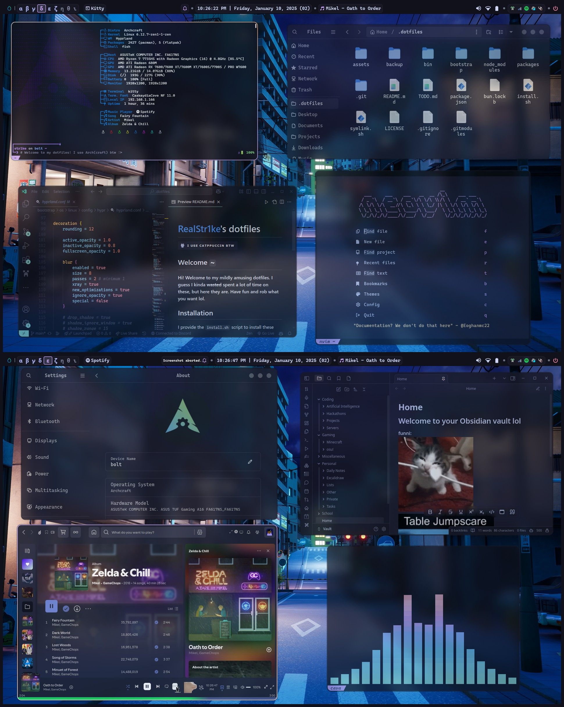
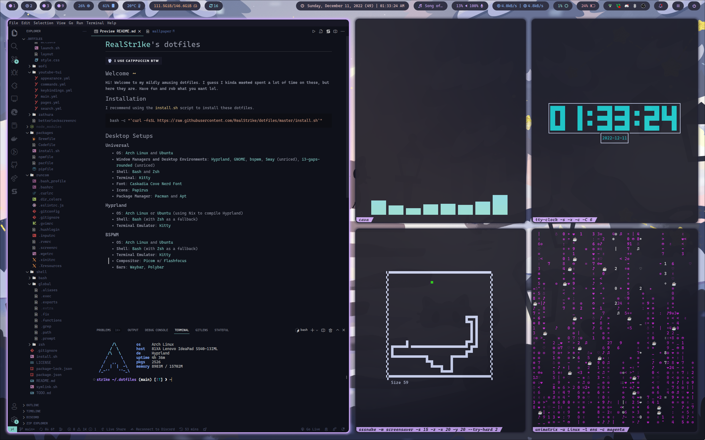

# [RealStr1ke](https://github.com/RealStr1ke)'s dotfiles


## Welcome `~`

**Hi! Welcome to my mildly amusing dotfiles. I guess I kinda ~~wasted~~ spent a lot of time on these, but here they are. Have fun and rob what you want lol.**

## Installation

I provide the `install.sh` script to install these dotfiles, but I **HIGHLY** recommend you take a detailed look all of my configurations and the installation script so you'll know what's being affected (seriously, I've barely used the script myself lol).

```Bash
bash -c "`curl -fsSL https://raw.githubusercontent.com/RealStr1ke/dotfiles/master/install.sh`"
```

## Showcase
<div align="center">
  <h3>HackClub Riceathon Winter 2024 Showcase</h3>
  
  
  [▶️ Watch the Showcase Video](https://cloud-6ji362ttf-hack-club-bot.vercel.app/0realstr1ke-riceathon-submission.mp4)
</div>
<div align="center">
  <h3>Hyprland Rice Competition Winter 2022 Showcase [Outdated]</h3>
  
  
  [▶️ Watch the Showcase Video](https://cloud-92tb4q7ml-hack-club-bot.vercel.app/0hyprland-rice-competition-submission-winter-2022.mp4)
</div>

# To-Do List
 - AGS
   - Add Wi-Fi info revealer to bar
   - Add an on-screen keyboard button to bar that launches wvkbd
   - Fix the volume slider
   - Create the following
     - Dashboard
     - Bar Quick Settings
     - Workspace Overview
 - Rewrite README
